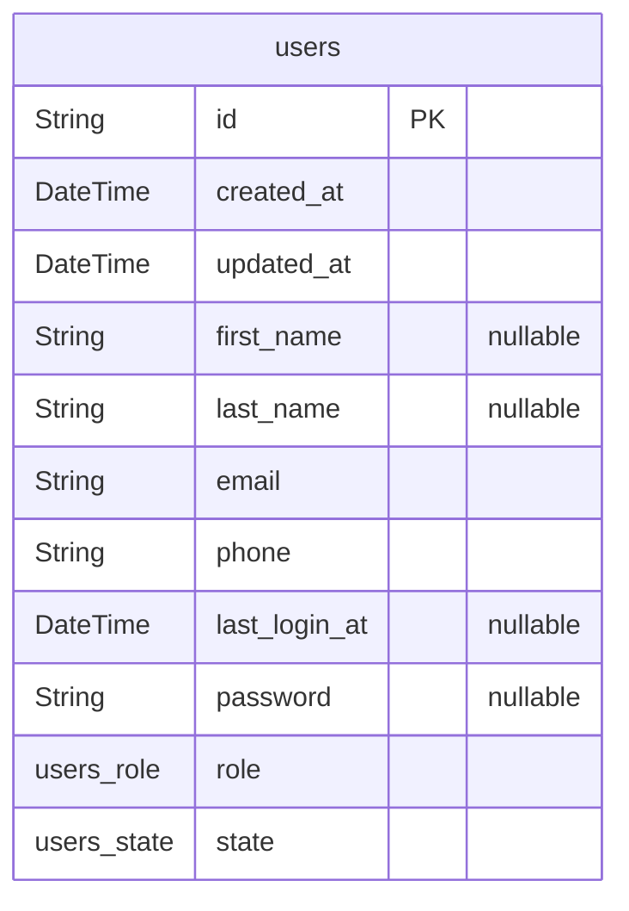

# EcoSync Database
> Generated by [`prisma-markdown`](https://github.com/samchon/prisma-markdown)

- [Accounts](#accounts)

## Accounts

### `users`
Represents users in the system.
This model stores information about users.

**Properties**
  - `id`: Unique identifier for the user.
  - `created_at`: Timestamp indicating when the user was created.
  - `updated_at`: Timestamp indicating when the user was last updated.
  - `first_name`: First name of the user (optional).
  - `last_name`: Last name of the user (optional).
  - `email`: Email address of the user.
  - `phone`: Phone number of the user.
  - `last_login_at`: Timestamp indicating when the user last logged in (optional).
  - `password`: Password associated with the user (optional).
  - `role`: Role of the user (default sts).
  - `state`: State of the user (default active).