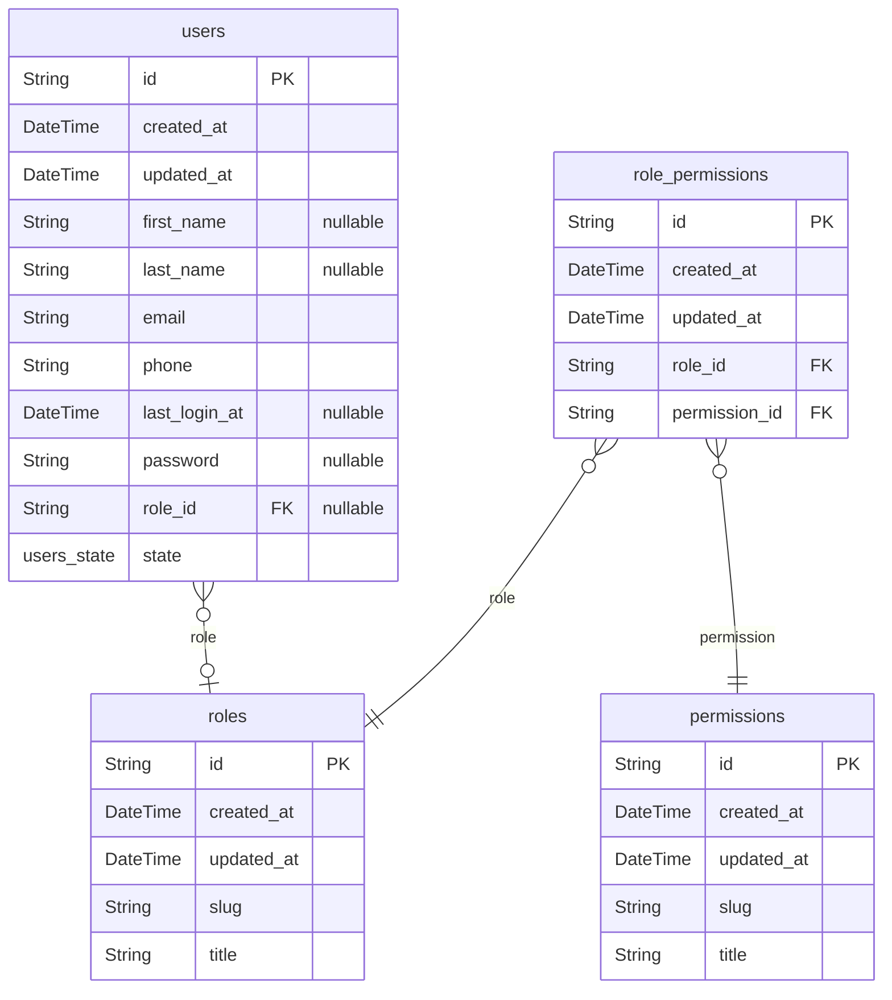
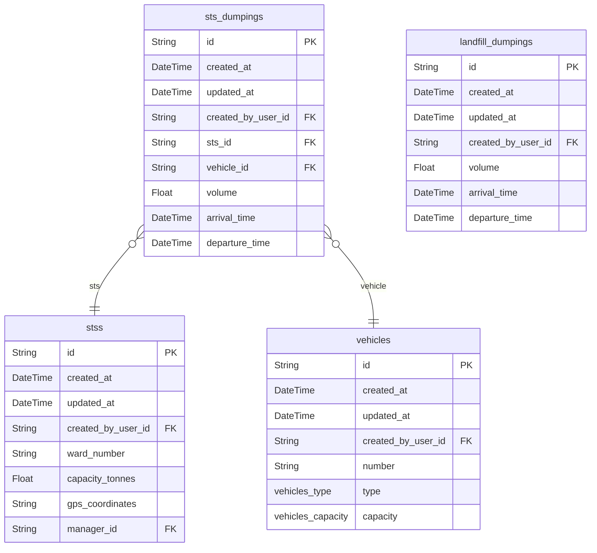

# EcoSync Database

> Generated by [`prisma-markdown`](https://github.com/samchon/prisma-markdown)

- [Accounts](#accounts)
- [default](#default)

## Accounts

### `users`

Represents users in the system.
This model stores information about users.

**Properties**

- `id`: Unique identifier for the user.
- `created_at`: Timestamp indicating when the user was created.
- `updated_at`: Timestamp indicating when the user was last updated.
- `first_name`: First name of the user (optional).
- `last_name`: Last name of the user (optional).
- `email`: Email address of the user.
- `phone`: Phone number of the user.
- `last_login_at`: Timestamp indicating when the user last logged in (optional).
- `password`: Password associated with the user (optional).
- `role_id`: Role of the user (default sts).
- `state`: State of the user (default active).

### `roles`

List of roles that a user can have.

**Properties**

- `id`: Unique identifier for the role.
- `created_at`: Timestamp indicating when the role was created.
- `updated_at`: Timestamp indicating when the role was last updated.
- `slug`: Name/slug of the role.
- `title`: Title of the role.

### `permissions`

Represents the permissions that a role can have.

**Properties**

- `id`: Unique identifier for the permission.
- `created_at`: Timestamp indicating when the permission was created.
- `updated_at`: Timestamp indicating when the permission was last updated.
- `slug`: Name/slug of the permission.
- `title`: Title of the permission.

### `role_permissions`

Represents the relationship between roles and permissions.

**Properties**

- `id`: Unique identifier for the role permission.
- `created_at`: Timestamp indicating when the role permission was created.
- `updated_at`: Timestamp indicating when the role permission was last updated.
- `role_id`: Role ID associated with the role permission.
- `permission_id`: Permission ID associated with the role permission.

## default

### `vehicles`

**Properties**

- `id`: Unique identifier for the vehicle.
- `created_at`: Timestamp indicating when the vehicle was created.
- `updated_at`: Timestamp indicating when the vehicle was last updated.
- `created_by_user_id`:
- `number`: Vehicle number.
- `type`: Type of the vehicle.
- `capacity`: Capacity of the vehicle.

### `stss`

**Properties**

- `id`: Unique identifier for the STS.
- `created_at`: Timestamp indicating when the STS was created.
- `updated_at`: Timestamp indicating when the STS was last updated.
- `created_by_user_id`:
- `ward_number`: Ward number of the STS.
- `capacity_tonnes`: Capacity of the STS.
- `gps_coordinates`: GPS coordinates of the STS.
- `manager_id`: STS manager ID associated with the STS.

### `sts_dumpings`

**Properties**

- `id`: Unique identifier for the STS entry.
- `created_at`: Timestamp indicating when the STS entry was created.
- `updated_at`: Timestamp indicating when the STS entry was last updated.
- `created_by_user_id`: User ID associated with the landfill entry.
- `sts_id`: STS ID associated with the STS entry.
- `vehicle_id`: Vehicle ID associated with the STS entry.
- `volume`: Volume of waste.
- `arrival_time`: Time of arrival.
- `departure_time`: Time of departure.

### `landfill_dumpings`

**Properties**

- `id`: Unique identifier for the landfill entry.
- `created_at`: Timestamp indicating when the landfill entry was created.
- `updated_at`: Timestamp indicating when the landfill entry was last updated.
- `created_by_user_id`: User ID associated with the landfill entry.
- `volume`: Volume of waste.
- `arrival_time`: Time of arrival.
- `departure_time`: Time of departure.
