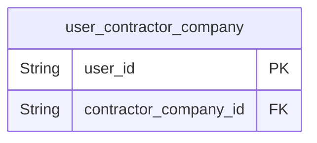

# EcoSync Database
> Generated by [`prisma-markdown`](https://github.com/samchon/prisma-markdown)

- [Accounts](#accounts)
- [Workforce](#workforce)
- [default](#default)

## Accounts

### `user`
Represents user in the system.
This model stores information about user.

**Properties**
  - `id`: Unique identifier for the user.
  - `created_at`: Timestamp indicating when the user was created.
  - `updated_at`: Timestamp indicating when the user was last updated.
  - `first_name`: First name of the user (optional).
  - `last_name`: Last name of the user (optional).
  - `email`: Email address of the user.
  - `phone`: Phone number of the user.
  - `last_login_at`: Timestamp indicating when the user last logged in (optional).
  - `password`: Password associated with the user (optional).
  - `role_id`: Role of the user (default sts).
  - `state`: State of the user (default active).

### `role`
List of role that a user can have.

**Properties**
  - `id`: Unique identifier for the role.
  - `created_at`: Timestamp indicating when the role was created.
  - `updated_at`: Timestamp indicating when the role was last updated.
  - `slug`: Name/slug of the role.
  - `title`: Title of the role.

### `permission`
Represents the permission that a role can have.

**Properties**
  - `id`: Unique identifier for the permission.
  - `created_at`: Timestamp indicating when the permission was created.
  - `updated_at`: Timestamp indicating when the permission was last updated.
  - `slug`: Name/slug of the permission.
  - `title`: Title of the permission.

### `role_permission`
Represents the relationship between role and permission.

**Properties**
  - `id`: Unique identifier for the role permission.
  - `created_at`: Timestamp indicating when the role permission was created.
  - `updated_at`: Timestamp indicating when the role permission was last updated.
  - `role_id`: Role ID associated with the role permission.
  - `permission_id`: Permission ID associated with the role permission.

## Workforce

### `user_contractor_company`
Represents the relation between user and contractor company.

**Properties**
  - `user_id`: User ID associated with the user contractor company.
  - `contractor_company_id`: Contractor company ID associated with the user contractor company.

## default

```mermaid
erDiagram
"vehicle" {
  String id PK
  DateTime created_at
  DateTime updated_at
  String created_by_user_id FK
  String sts_id FK
  String number
  vehicle_type type
  vehicle_capacity capacity
  Float loaded_cost "nullable"
  Float unloaded_cost "nullable"
}
"sts" {
  String id PK
  String name
  DateTime created_at
  DateTime updated_at
  String created_by_user_id FK
  String ward_number
  Float capacity_tonnes
  Float latitude
  Float longitude
  String manager_id
}
"landfill" {
  String id PK
  String name
  DateTime created_at
  DateTime updated_at
  String created_by_user_id FK
  Float capacity_tonnes
  Float latitude
  Float longitude
  String opens_at
  String closes_at
}
"transportation" {
  String id PK
  DateTime created_at
  DateTime updated_at
  String created_by_user_id FK
  String sts_id FK "nullable"
  String landfill_id FK "nullable"
  String vehicle_id FK
  String contractor_id FK "nullable"
  Float volume
  DateTime arrival_time "nullable"
  DateTime departure_time "nullable"
  Boolean padding
  Float distance
  transportation_location_type location_type "nullable"
}
"issue" {
  String id PK
  String title
  String description
  String type
  String attachments
  issue_status status "nullable"
  DateTime created_at
  DateTime updated_at
  String created_by_user_id FK "nullable"
  Float latitude "nullable"
  Float longitude "nullable"
}
"post" {
  String id PK
  String content
  post_type type
  String attachments
  Int flag_score
  DateTime created_at
  DateTime updated_at
  String created_by_user_id FK "nullable"
}
"blocked_words" {
  String id PK
  String word
  Int weight
  DateTime created_at
}
"contractor_company" {
  String id PK
  String name
  String contract_id
  String registration_id
  DateTime registration_date
  String tin
  String contact_number
  Int workforce_size
  Float payment_per_tonnage
  Float required_amount_per_day
  String contract_duration
  String area_of_collection
  String sts_id FK
}
"workforce_log" {
  String id PK
  workforce_log_type type
  String workforce_id FK
  Float latitude "nullable"
  Float longitude "nullable"
  DateTime created_at
  DateTime updated_at
}
"workforce" {
  String id PK
  String full_name
  DateTime dob
  DateTime hired_at
  String job_title
  Float payment_rate
  String contact_information
  String contractor_id FK
  String assigned_collection_route
}
"vehicle" }o--|| "sts" : sts
"transportation" }o--o| "sts" : sts
"transportation" }o--o| "landfill" : landfill
"transportation" }o--|| "vehicle" : vehicle
"transportation" }o--o| "contractor_company" : contractor
"contractor_company" }o--|| "sts" : sts
"workforce_log" }o--|| "workforce" : workforce
"workforce" }o--|| "contractor_company" : contractor_company
```

### `vehicle`

**Properties**
  - `id`: Unique identifier for the vehicle.
  - `created_at`: Timestamp indicating when the vehicle was created.
  - `updated_at`: Timestamp indicating when the vehicle was last updated.
  - `created_by_user_id`: 
  - `sts_id`: 
  - `number`: Vehicle number.
  - `type`: Type of the vehicle.
  - `capacity`: Capacity of the vehicle.
  - `loaded_cost`: Fuel cost per Kilometer when full load.
  - `unloaded_cost`: Fuel cost per Kilometer when empty load.

### `sts`

**Properties**
  - `id`: Unique identifier for the STS.
  - `name`: 
  - `created_at`: Timestamp indicating when the STS was created.
  - `updated_at`: Timestamp indicating when the STS was last updated.
  - `created_by_user_id`: 
  - `ward_number`: Ward number of the STS.
  - `capacity_tonnes`: Capacity of the STS.
  - `latitude`: GPS coordinates of the STS.
  - `longitude`: 
  - `manager_id`: STS manager ID associated with the STS.

### `landfill`

**Properties**
  - `id`: Unique identifier for the STS.
  - `name`: Name of the landfill
  - `created_at`: Timestamp indicating when the STS was created.
  - `updated_at`: 
  - `created_by_user_id`: 
  - `capacity_tonnes`: Capacity of the STS.
  - `latitude`: GPS coordinates of the STS.
  - `longitude`: 
  - `opens_at`: Operational time
  - `closes_at`: 

### `transportation`

**Properties**
  - `id`: Unique identifier for the STS entry.
  - `created_at`: Timestamp indicating when the STS entry was created.
  - `updated_at`: Timestamp indicating when the STS entry was last updated.
  - `created_by_user_id`: User ID associated with the landfill entry.
  - `sts_id`: STS ID associated with the STS entry.
  - `landfill_id`: Landfill ID where the wast is dumped
  - `vehicle_id`: Vehicle ID associated with the STS entry.
  - `contractor_id`: Contractor ID associated with the STS entry.
  - `volume`: Volume of waste.
  - `arrival_time`: Time of arrival.
  - `departure_time`: Time of departure.
  - `padding`: 
  - `distance`: Distance from the STS to the landfill.
  - `location_type`: Type of the location.

### `issue`

**Properties**
  - `id`: Unique identifier for the STS.
  - `title`: Title of the issue
  - `description`: 
  - `type`: Type of the issue - overflowing bins, littering, illegal dumping, or damaged infrastructure.
  - `attachments`: Attachments of the issue
  - `status`: Status of the issue 
  - `created_at`: Timestamp indicating when the report was issued
  - `updated_at`: 
  - `created_by_user_id`: 
  - `latitude`: GPS coordinates of the STS.
  - `longitude`: GPS coordinates of the STS.

### `post`

**Properties**
  - `id`: Unique identifier for the STS.
  - `content`: Content of the post
  - `type`: Type of the post: event, announcement, post
  - `attachments`: Attachments of the post
  - `flag_score`: Flag score to determine if the post is spam
  - `created_at`: Timestamp indicating when the post was made
  - `updated_at`: 
  - `created_by_user_id`: 

### `blocked_words`

**Properties**
  - `id`: Unique identifier for the STS.
  - `word`: Word that is blocked
  - `weight`: Weight of the word
  - `created_at`: Timestamp indicating when the post was made

### `contractor_company`

**Properties**
  - `id`: Unique identifier for the contractor company.
  - `name`: Name of the company
  - `contract_id`: Contract ID
  - `registration_id`: Registration ID
  - `registration_date`: Registration Date
  - `tin`: TIN of the company
  - `contact_number`: Contact number
  - `workforce_size`: Workforce size
  - `payment_per_tonnage`: Payment per tonnage of waste
  - `required_amount_per_day`: The required amount of waste per day
  - `contract_duration`: Contract duration
  - `area_of_collection`: Area of collection
  - `sts_id`: Designated STS

### `workforce_log`

**Properties**
  - `id`: Unique identifier for the STS.
  - `type`: Type of log: start, end
  - `workforce_id`: Workforce ID
  - `latitude`: GPS Coordinates of the current location
  - `longitude`: 
  - `created_at`: Timestamp indicating when the post was made
  - `updated_at`: 

### `workforce`

**Properties**
  - `id`: Unique identifier for the STS.
  - `full_name`: Full name of the workforce
  - `dob`: Date of Birth
  - `hired_at`: Date of Hire
  - `job_title`: Job Title
  - `payment_rate`: Payment rate per hour
  - `contact_information`: Contact Information
  - `contractor_id`: Contractor ID
  - `assigned_collection_route`: Assigned Collection Route